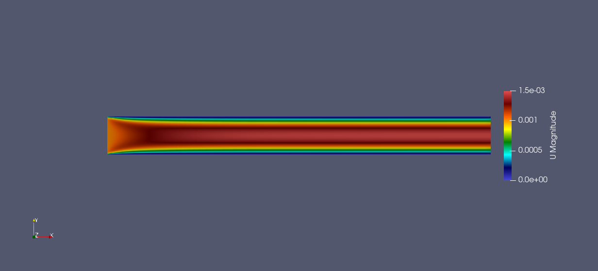
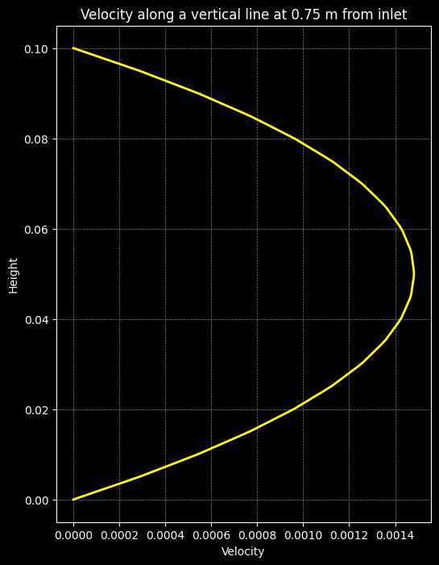
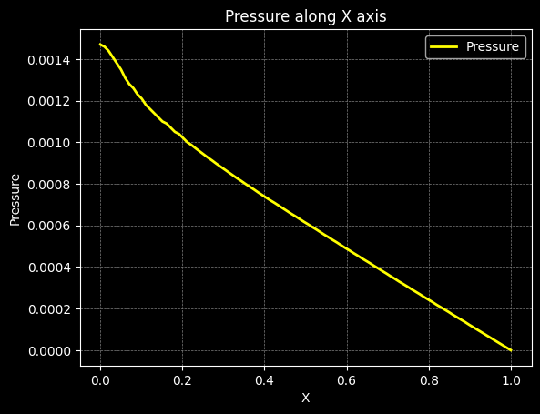
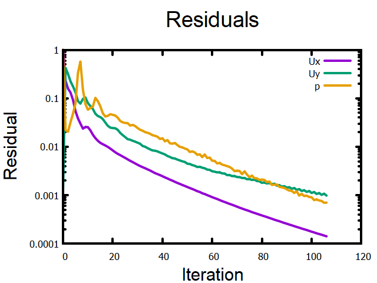

# CFD Analysis of Poiseuille Flow

This project presents a **Computational Fluid Dynamics (CFD)** analysis of laminar Poiseuille flow in a 2D channel. The simulation investigates the velocity and pressure distribution along the flow domain using **OpenFOAM** and visualizes results in **Python**. Residuals plot is created using **gnuplot**.

---

## Project Overview

Poiseuille flow refers to the **laminar flow of a viscous fluid in a channel or pipe**, driven by a pressure gradient. The study aims to:

- Compute the **velocity field** and **pressure field**.
- Visualize **velocity and pressure contours**.
- Extract and plot **velocity and pressure profiles** along selected lines.
- Examine **residuals** to ensure solution convergence.

---

## Tools & Libraries

- **CFD Solver:** OpenFOAM  
- **Data Analysis & Visualization:** Python, Pandas, Matplotlib, gnuplot  
- **Plot Types:** Contour plots, Line profiles, Residual plots  

---

## Simulation Results

### 1. Velocity Contour

The following figure shows the velocity magnitude across the domain:

---

### 2. Velocity Profile

Velocity along a vertical line (X = 0.75 m) demonstrates the classic **parabolic Poiseuille profile**:

---

### 3. Pressure Contour

Pressure distribution along the domain shows a **linear drop** along the flow direction, characteristic of laminar channel flow:

---

### 4. Pressure Profile

Pressure along the centerline (Y = mid-height) highlights the **linear decrease** along the X-axis:

---

### 5. Residuals

Residuals of velocity and pressure components during iterative solution demonstrate **convergence**:

---

