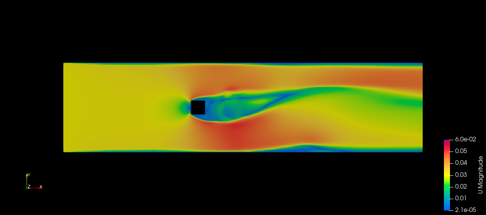

# OpenFOAM Simulation Case

This README provides a detailed overview of the OpenFOAM case setup for simulating fluid flow in a domain with obstacles. The configuration includes mesh definitions, boundary conditions, and simulation parameters.

## Table of Contents

- [Case Overview](#case-overview)
- [Mesh Configuration](#mesh-configuration)
- [Boundary Conditions](#boundary-conditions)
- [Simulation Settings](#simulation-settings)
- [Files Included](#files-included)
- [Running the Simulation](#running-the-simulation)

## Case Overview

This OpenFOAM case is designed to simulate steady-state laminar fluid flow through a rectangular domain with obstacles. The domain is defined with specific mesh configurations and boundary conditions suitable for analyzing fluid dynamics around obstacles.

## Mesh Configuration

The mesh is defined in the `blockMeshDict` file and is scaled by a factor of `0.01`. This setup includes:

- **Vertices**: Coordinates defining the corners of the mesh blocks.
- **Blocks**: Hexahedral cells that partition the domain. Includes:
  - **Pre-block**: The main domain before obstacles.
  - **Obstacle Blocks**: Regions containing obstacles.
  - **Post-block**: The domain beyond the obstacles.
- **Boundary**: Defines different boundary types:
  - `inlet`
  - `outlet`
  - `wall`
  - `obstacle`
  - `frontAndBack` (empty for 2D simulation)

## Boundary Conditions

Boundary conditions are specified for the velocity field (`U`) and the pressure field (`p`):

- **Velocity (`U`)**:
  - **`inlet`**: `fixedValue` type with velocity set to `(0.03 0 0)`.
  - **`outlet`**: `zeroGradient` type.
  - **`wall`**: `fixedValue` type with velocity set to `(0 0 0)`.
  - **`obstacle`**: `fixedValue` type with velocity set to `(0 0 0)`.
  - **`frontAndBack`**: `empty` type.
  
- **Pressure (`p`)**:
  - **`inlet`**: `zeroGradient` type.
  - **`outlet`**: `fixedValue` type with pressure set to `0`.
  - **`wall`**: `zeroGradient` type.
  - **`obstacle`**: `zeroGradient` type.
  - **`frontAndBack`**: `empty` type.

## Simulation Settings

Simulation parameters are defined in the `controlDict` file:

- **`application`**: `simpleFoam` for steady-state simulations.
- **`startFrom`**: `startTime` with `startTime` set to `0`.
- **`endTime`**: `1000` with `deltaT` set to `1`.
- **`writeControl`**: `timeStep` with `writeInterval` set to `100` time steps.
- **`writeFormat`**: `binary` with `writePrecision` set to `6` and `writeCompression` turned off.
- **`timeFormat`**: `general` with `timePrecision` set to `6`.
- **`runTimeModifiable`**: `true` allowing runtime modifications.

## Files Included

- `blockMeshDict`: Defines the mesh configuration, including vertices, blocks, edges, and boundary conditions.
- `controlDict`: Contains simulation settings and control parameters.
- `0/U`: Initial condition for velocity field.
- `0/p`: Initial condition for pressure field.
- `constant/transportProperties`: Defines transport properties like viscosity and density.

## Running the Simulation

To run the simulation:

1. **Prepare the Case**:
   - Place the `blockMeshDict` and other configuration files in the appropriate directories (e.g., `system`, `constant`, `0`).
   You can also download/clone/copy the `preRun` directory and use the following command in terminal

2. **Generate the Mesh**:
   ```bash
   blockMesh
   ```
3. **Run Simulation** :

    ```bash
    simpleFoam
    ```

## Result 

Velocity profile

