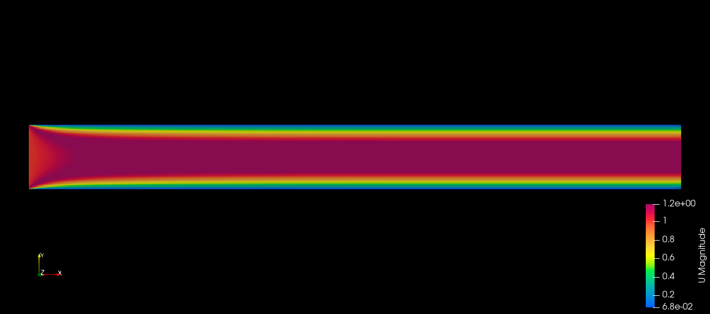
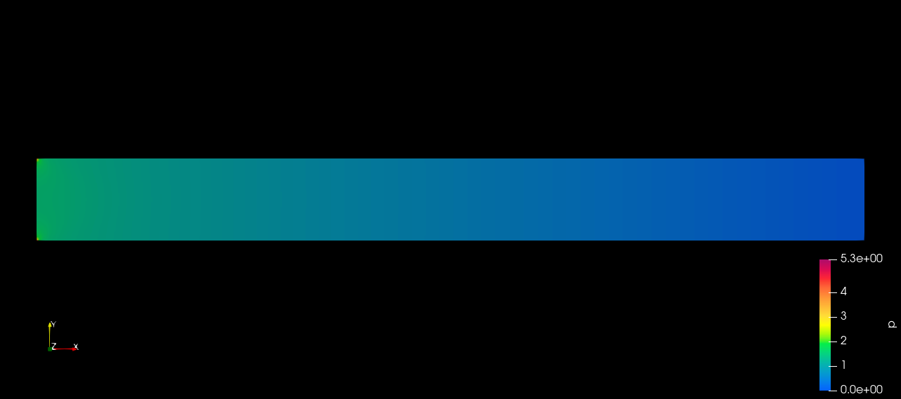

# Poiseuille Flow

This README file contains a brief description of the simulation of Poiseuille Flow. 
To run the case, download/clone/copy `before-run` directory, go to case folder in your local machine using linux terminal and use the following commands:

```bash
blockMesh
```
```bash
icoFoam | tee log
```
Note: tee log provides a log file about the simulation.


## Result

### Velocity after 5 Seconds


### Pressure after 5 Seconds


## Assumptions
1. Laminar flow
2. Incompressible flow
3. Transient flow
4. 2-dimensional case
5. Flow direction along the X-axis only

## Boundary Conditions

### 1. Pressure Field (`p`)

#### Inlet: `zeroGradient`
The pressure gradient is set to zero at the inlet boundary, implying no pressure change along the boundary.

#### Outlet: `fixedValue`
The pressure is fixed to the value of the internal field, which is 0 in this case.

#### TopAndBottom: `zeroGradient`
The pressure gradient is zero on the top and bottom boundaries, indicating no pressure change along these boundaries.

#### FrontAndBack: `empty`
These boundaries are treated as empty, implying that they do not affect the flow and are effectively not included in the calculations.

### 2. Velocity Field (`U`)

#### Inlet: `fixedValue`
The velocity is fixed to `(1 0 0)`, representing a uniform flow with a velocity of 1 unit in the x-direction.

#### Outlet: `zeroGradient`
The velocity gradient is zero at the outlet, meaning the velocity is assumed to be constant and not changing in the direction normal to the boundary.

#### TopAndBottom: `fixedValue`
The velocity is fixed to `(0 0 0)`, indicating no flow (zero velocity) on the top and bottom boundaries.

#### FrontAndBack: `empty`
These boundaries are treated as empty, similar to the pressure field, meaning no influence on the flow.

### 3. Transport Properties (`transportProperties`)

The viscosity of the fluid is set to `0.01` (in appropriate units), defining the fluid's resistance to flow and deformation.
